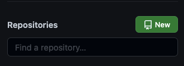
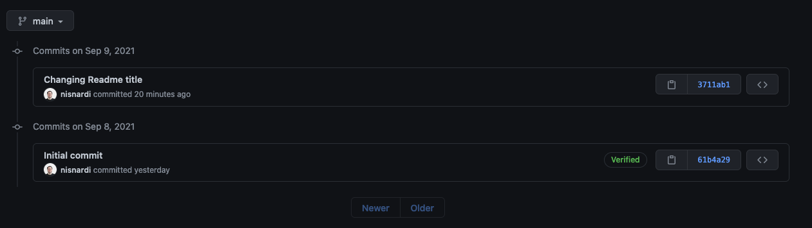

# Git & Github

## Git

> Git is a free and open source **distributed version control system** designed to handle everything from small to very large projects with speed and efficiency.

* [Donwload and install Git](https://git-scm.com)
* After install run the following command on your terminal

```bash
$ git --version

2.31.0
```

* v2.31.0 is just the current Git version but it can change over time.

### Setting your commit email address in Git

You can use the git config command to change the email address you associate with your Git commits. 

##### Setting your email address for every repository on your computer

* Open Terminal.
* Set your email address in Git. (replace "email@example.com" by your own email address and keep the double quotes").

```bash
$ git config --global user.email "email@example.com"
```

* Confirm that you have set the email address correctly in Git:

```bash
$ git config --global user.email

you should see your email address here
```

* Now lets configure / change the name of our initial branch name for all our new projects.
* We no longer use the concept of master / slave for our branches and we're moving into using `main` as the initial project branch name.
* You can find more about it in the following blog post - [New Git Default branch name](https://about.gitlab.com/blog/2021/03/10/new-git-default-branch-name/).
* When creating a new project now a day you would get the following warning / message:

```bash
hint: Using 'master' as the name for the initial branch. This default branch name
hint: is subject to change. To configure the initial branch name to use in all
hint: of your new repositories, which will suppress this warning, call:
hint:
hint: 	git config --global init.defaultBranch <name>
hint:
hint: Names commonly chosen instead of 'master' are 'main', 'trunk' and
hint: 'development'. The just-created branch can be renamed via this command:
hint:
hint: 	git branch -m <name>
```

* Type the following command:

```bash
$ git config --global init.defaultBranch main
```

* You could choose any branch name but it's great to use the convention the community is taking so we'll use `main` for this course and encourage you to use it for your own projects as well.

### Add Git to a Project

* As part of this course we're going to be using our [command line interface](https://en.wikipedia.org/wiki/Command-line_interface) a lot so it's worth to go over some common concepts.

* Some commands change between Operating Systems and we're going to be using the Linux / Mac ones.

* This can help in case you're using Windows Command Prompt - [Cheat sheet](http://simplyadvanced.net/blog/cheat-sheet-for-windows-command-prompt)

* [Linux/Mac Bash Cheat sheet](https://learncodethehardway.org/unix/bash_cheat_sheet.pdf).

* Also, you can use this [Cheat sheet](https://learncodethehardway.org/unix/bash_cheat_sheet.pdf) if you're using Linux or Mac Bash.


#### Create a local folder for your project

* As we're going to be working with many files it would be nice to group them inside a folder.
* We're going to be learning JavaScript and doing a lot of exercises and we'll use GIT to track our progress and version our exercise files.
* To create a new folder / directory we use the `mkdir` command (Make Dir just in case).
* We'll use the project name 'comit-javascript-react-native-course'.
* Open a terminal and type the following command.

```bash
$ mkdir comit-javascript-react-native-course
```

* Next we need to `change directory` from the current location into the project one
* We can use the `cd (change directory)` command
* In order to use this command we need to specify the directory or path where we want to change to.
* Example:

```bash 
cd myfolder
cd ~/my-projects
cd ../
```

* In our case we need to change directory to the new project location so we'll use the project folder name.

```bash
$ cd comit-javascript-react-native-course
```

* Now lets make sure we're in the rigth folder and to do that we can use the `pwd` command that will print out the current path.
* This will change depending your OS and also directory structure but at the end of the path you should see the project name `comit-javascript-react-native-course`

```bash
$ pdw

/comit-javascript-react-native-course
```

* If you see comit-javascript-react-native-course as the last folder name it means you're in the right place.
* In case you don't see comit-javascript-react-native-course please ask your teacher about it befofe moving forward.
* At this point we have everything we need to start versioning our `comit-javascript-react-native-course` folder / project.

### Git Status
* `git status` show the Git working tree status
* [Git status doc](https://git-scm.com/docs/git-status)
* Run the following command:

```bash
$ git status
```

* You should see the following legend: fatal: `Not a git repository (or any of the parent directories): .git`.
* We get this error message as we didn't told Git to start watching this project.
* To fix this we need to tell git to start tracking our project changes.
* We use the `git init` command.

### Git init
* This command create an empty Git repository or reinitialize an existing one
* To configure Git in this folder well run `git init`
* [Git init doc](https://git-scm.com/docs/git-init)

```bash
$ git init

Initialized empty Git repository in /comit-javascript-react-native-course/.git/
```

* You should get the following message: `Initialized empty Git repository in your folder path`.
* Now Git knows that we want to version this project and keep track of all the changes we do.
* Let check git status again.

```bash
git status

> On branch main
> No commits yet
> nothing to commit (create/copy files and use "git add" to track)
```

* After running **git init** we don't longer see an error.
* Now we find out that we'll be using **branches**, **commits** & **add**ing files.
* Git creates a hidden folder to keep track of our project changes / config.
* The name of the folder is `.git`.
* List your folder files to see the `.git` folder.
* To list a folder files we use the `ls` command and `-la` as parameter to format the output.

```bash
$ ls -la

> .
> ..
> .git
```

* We can see that Git created a new hidden folder named `.git` when we ran the `git init` command.
* Git will look for this folder to know if it's already versioning our project.
* Lets see what the `.git` folder has inside.

```bash
$ ls -la .git

> HEAD
> branches
> config
> description
> hooks
> info
> objects
> refs
```

## Add files to our Project

* To start adding files to our project we're going to open our IDE (Visual Studio Code).
* Open VS Code.
* Go to Files => Open => Navigate/choose the `comit-javascript-react-native-course` folder.
* Create a new file by going to File => New File or press Command / CTRL + N.
* Save the file as example.js by going to File => Save or press CTRL / Command + S.
* When you edit a file in VS code it will show a circle next to the file name on the main tab.
* Once you save the file the circle will go away.
* Lets check `git status`

```bash
$ git status

On branch main

No commits yet

Untracked files:
  (use "git add <file>..." to include in what will be committed)
	example.js
```

* So we still get the same messages:
  * On branch master
  * No commits yet
* But now we can see that we added a new file to the folder and Git knows about it.
* As we haven't done anything with this file it have an `Untracked` state.
* Also Git gives us some help: `use "git add <file>..." to include in what will be committed`.

### Git add

* This command add file/s content to Git index.
* Lets add the example.js to the Git index.

```bash
$ git add example.js
```

* At first it looks like nothing happened.
* Check git status again.

```bash
$ git status

On branch main

No commits yet

Changes to be committed:
  (use "git rm --cached <file>..." to unstage)
	new file: example.js
```

* By executing **git add** we add the document/s that we want to **commit**.

### Git commit
* This command saves changes to the repository.
* When we commit one or many files we create a `new version` of our project.
* To know what changed over time it's a good practice to write a descriptive message.
* Now we can commit our changes running **git commit -m 'Commit message'**.

```bash
$ git commit -m 'Added example.js file to my project'

[main (root-commit) 44d3eb7] Added example.js file to my project
 1 file changed, 0 insertions(+), 0 deletions(-)
 create mode 100644 example.js
```

* We can see that only 1 file has changed and we didn't add or delete any file line/s.
* Run git status to check the new status.

```bash
$ git status

On branch main
nothing to commit, working tree clean
```

* As we just commited our changes there's nothing new to commit.

### Git log

* This command shows commit logs.
* We can check our project commit history by running **git log**.

```bash
$ git log

commit 44d3eb7d00286bbb85eef712175f7495b5d5a839 (HEAD -> main)
Author: Nicolas Isnardi <nicolasisnardi@gmail.com>
Date:   Tue Feb 2 20:45:41 2021 -0500

    Added example.js file to my project
```

* Once we run this command we can see the project commit history.
* By writing good commit messages we can know more about what changed over time.
* Update the example.js file to: (replace 'your name' by your name)

```js
const name = 'your name';
```

* Save your file (CTRL / Command + S).
* Check Git status.

```bash
$ git status

On branch main
Changes not staged for commit:
  (use "git add <file>..." to update what will be committed)
  (use "git restore <file>..." to discard changes in working directory)
	modified:   example.js

no changes added to commit (use "git add" and/or "git commit -a")
```

* Now we can see a couple of new things going on:
  * Git shows 2 options:
    * We can add the changes we did to example.js to commit them: `(use "git add <file>..." to update what will be committed)`
    * Also we can checkout the previous example.js version and discard the changes we did: `(use "git checkout -- <file>..." to discard changes in working directory)`
  * Also now example.js is modified (`modified:   example.js`) instead than a new file.

* Go ahead and add this change.
* Check the status

```bash
$ git add example.js
$ git status

On branch main
Changes to be committed:
  (use "git restore --staged <file>..." to unstage)
	modified:   example.js
```

* Commit the change and create a new version.
* The commit message should be: Updated example.js content.

```bash
$ git commit -m 'Updated example.js content'

[main f45b39e] Updated example.js content
 1 file changed, 1 insertion(+)
```

* Check `git log`.

```bash
$ git log

commit f45b39e6323f271361c12238eaf89c978ba325e6 (HEAD -> main)
Author: Nicolas Isnardi <nicolasisnardi@gmail.com>
Date:   Tue Feb 2 21:05:04 2021 -0500

    Updated example.js content

commit 44d3eb7d00286bbb85eef712175f7495b5d5a839
Author: Nicolas Isnardi <nicolasisnardi@gmail.com>
Date:   Tue Feb 2 20:45:41 2021 -0500

    Added example.js file to my project
```

* Now we have 2 commits in our project log.
* Delete example.js file.
* To delete a file we can use the `rm file_name` command

```bash
$ rm example.js
```

* Check Git status.

```bash
$ git status

On branch main
Changes not staged for commit:
  (use "git add/rm <file>..." to update what will be committed)
  (use "git restore <file>..." to discard changes in working directory)
	deleted:    example.js

no changes added to commit (use "git add" and/or "git commit -a")
```

* We can see that we deleted the file.
* Git shows 2 options.
  * We can remove the file from git project by running `git rm`.
  * Or discard the changes running `git restore example.js`.
* As we don't want to delete the file, `git restore example.js` to get the previous version.

```bash
$ git restore example.js
```

* If we run `git status` command we'll see that the deleted example.js message is no longer there.

```bash
$ git status

On branch main
nothing to commit, working tree clean
```

* Also if we list our folder files we'll see that example.js file is still there.

```bash
ls -la

.
..
.git
example.js 
```
### git rm

* To delete one or many files from a project we can run **git rm**.
* This command remove files from the working tree and from the index.
* Delete example.js from the project.

```bahs
$ git rm example.js

rm 'example.js'
```

* Check Git status

```bash
$ git status

On branch main
Changes to be committed:
  (use "git restore --staged <file>..." to unstage)
	deleted:    example.js
```

* Git rm works like git add but instead of adding the file we'll delete it from the project.
* Now we need to commit our change and delete the example file.

```bash
$ git commit -m 'Deleted example.js'

[main e162308] deleted example.js
 1 file changed, 1 deletion(-)
 delete mode 100644 example.js
```

* Now check Git status.

```bash
$ git status

On branch main
nothing to commit, working tree clean
```

* List all the folder files.

```bash
$ ls -la

.
..
.git
```

* Finaly check `git log`.

```bash
$ git log

commit e16230830a293b4f173122bc687a4dbc40da1ad2 (HEAD -> main)
Author: Nicolas Isnardi <nicolasisnardi@gmail.com>
Date:   Tue Feb 2 21:14:37 2021 -0500

    deleted example.js

commit f45b39e6323f271361c12238eaf89c978ba325e6
Author: Nicolas Isnardi <nicolasisnardi@gmail.com>
Date:   Tue Feb 2 21:05:04 2021 -0500

    Updated example.js content

commit 44d3eb7d00286bbb85eef712175f7495b5d5a839
Author: Nicolas Isnardi <nicolasisnardi@gmail.com>
Date:   Tue Feb 2 20:45:41 2021 -0500

    Added example.js file to my project
```

* We can see that we added example.js file.
* Then we updated the file content.
* Finally we deleted it.
* Now we have an empty project again but with git history.
* Create a js folder.

```bash
$ mkdir js
```

* We are going to use this folder to store / save our JavaScript exercises.
* You are going to keep versions of your files when working in a new exercise or update one.
* Create a new exercise file named `exercise-1.js` and save it inside the js folder.
* Check git status.

```bash
$ git status

On branch main
Untracked files:
  (use "git add <file>..." to include in what will be committed)
	js/

nothing added to commit but untracked files present (use "git add" to track)
```

* We see a message that we have Untracked files so we need to let Git know that we want to track the js folder.
* Add the js folder to our git project by running git add.

```bash
$ git add js

On branch main
Changes to be committed:
  (use "git restore --staged <file>..." to unstage)
	new file:   js/exercise-1.js
```

* Now we see that Git knows about the js folder and that we added a new file.
* Git will track all of our changes.
* Open the `exercise-1.js` file and add the following code.

```js
console.log('Hello JavaScript World');
```

* Check Git status again.

```bash
On branch main
Changes to be committed:
  (use "git restore --staged <file>..." to unstage)
	new file:   js/exercise-1.js

Changes not staged for commit:
  (use "git add <file>..." to update what will be committed)
  (use "git restore <file>..." to discard changes in working directory)
	modified:   js/exercise-1.js
```

* At this stage Git knows that we have a new file and that change has been staged to commit.
* Also, Git knows that we modified the exercise file and that there's a new version of it.
* In order to add the new change we need to add it again.

```bash
$ git add js/exercise-1.js
$ git status

On branch main
Changes to be committed:
  (use "git restore --staged <file>..." to unstage)
	new file:   js/exercise-1.js
```

* Git now knows that we changed the file content but it's still a new file.
* Create a new commit to add the file.

```bash
$ git commit -m "added new exercise 1 file"

[main 1ecd6cd] added new exercise 1 file
 1 file changed, 1 insertion(+)
 create mode 100644 js/exercise-1.js

 $ git status

On branch main
nothing to commit, working tree clean
```

* Once we create a new commit Git changes the status as there's no change to this version of your files/project.
* From now on we can use Git to version our files.
* We create a new file or update one.
* Add that file to be tracked by Git by calling `git add`
* Create a new git version by commiting your changes calling `git commit`.
* You can always know what's the current project git status by calling `git status` command.
* Also, you can know all the changes that happened over time checking the project log calling `git log`.

```bash
$ git log

commit 1ecd6cd0100a178936112f178bf66ff31dd9c6ad (HEAD -> main)
Author: Nicolas Isnardi <nicolasisnardi@gmail.com>
Date:   Tue Feb 2 21:14:37 2021 -0500

    added new exercise 1 file

commit e16230830a293b4f173122bc687a4dbc40da1ad2
Author: Nicolas Isnardi <nicolasisnardi@gmail.com>
Date:   Tue Feb 2 21:14:37 2021 -0500

    deleted example.js

commit f45b39e6323f271361c12238eaf89c978ba325e6
Author: Nicolas Isnardi <nicolasisnardi@gmail.com>
Date:   Tue Feb 2 21:05:04 2021 -0500

    Updated example.js content

commit 44d3eb7d00286bbb85eef712175f7495b5d5a839
Author: Nicolas Isnardi <nicolasisnardi@gmail.com>
Date:   Tue Feb 2 20:45:41 2021 -0500

    Added example.js file to my project
```

* When working on a project or your course exercies you can follow the same git worflow to version your code and log your progress.
* So far it's greate because we can version our code locally and work by our selves.
* How can we share / show this code to others or keep a remote copy in case something goes wrong with our device?
* There's something called Github that can help us out.

## GitHub

### What's Github

[What's Github - by Github](https://www.youtube.com/watch?v=w3jLJU7DT5E)
[Git vs. GitHub: What's the difference?](https://www.youtube.com/watch?v=wpISo9TNjfU)

### Create a Github Account

* Open [Github site](https://github.com/)
* Click Sign Up
* Follow the steps to create a new account

Add the email address to your account on GitHub, so that your commits are attributed to you and appear in your contributions graph. For more information, see "Setting your commit email address in Git"

### Create a Github project

* After creating your account you can now create new projects
* From your Dashboard look for the New button



* You should see a form to create a new project


* Use `comit-js` as project name
* Add `ComIT JavaScript Exercises` 
* Leave Public selected so everyone can see your code!!
* Check Add a README.md
* Check Add .gitignore
* Select Node as template
* Click `create repository` button
* After creating the project you should see the project site
* You can find it under the following url `https://github.com/{your-user}/comit-js`


* Github uses the REAMDE.md file as you main project doc.
* MD files use Markup language and you can learn more about it [here](https://guides.github.com/features/mastering-markdown)
* Take your time to read the guide as you will need it later on

### Git and Github

* Github is a Git repository container
* This means that you will use GIT to version your code
* Github will be a remote repository where you will store / share your code
* To get the initial Github project code we need to clone it

### Git clone

* You should have a clone button in your project main page
* Click the `code` button


* Now you should see the following options:


* We need to use the Clone HTTPS or SSH url
* To learn how to use / configure SSH in Github you can read the following [SSH Doc](https://docs.github.com/en/github/authenticating-to-github/connecting-to-github-with-ssh).
* Read the following sections: `Generating a new SSH key and adding it to the ssh-agent` and `Adding a new SSH key to your GitHub account`
* For now you can use HTTPS that will ask your username and password when you want to push your changes to Github
* Click the HTTPS Clone Button


* Copy the URL or use the copy button on the right side of the URL

### Git clone

* Once you have a Github / Git project created you can clone it where ever you want
* You can clone the project in different devices but also it can be shared by different Github users
* This means that by creating a Github project you're able to share it with other developers to work together
* To clone the project we use the `git clone` command
* Git clone will use the project URL, for example: `git clone https://github.com/nisnardi/comit-js.git`

```bash
git clone {PASTE YOUR URL}
```

* Once Git is over you should see a new `comit-js` folder
* Change directory to this new comit-js folder

```bash
cd comit-js
```

* List the files to see if the folder is empty

```bash
ls -la

.
..
.git
.gitignore
README.md
```

* You can see that the folder is not empty
* This happen because Github created some initial project files for us
* `.git` folder is a hidden folder that Git will use to track our changes
* `.gitignore` is a file that we can use to add rules for Git to ignore some files (won't version them) in order to not share unwanted files or they can be recreated by running some local command / script.
* README.md is the file that GITHUB uses to show your project documentation
* So what's the difference between creating a local Git project or use Github?

### Local Git project vs Github one

* When we create a local Git project it will work only in our device
* If we want to share the code with others or have an online version we need to have a remote source
* Github will be our remote source during this course and there's others that you can use as well but Github is the most used one
* Local projects won't have configured a remote source unless you manually do it
* When we cloned Github project, Git added a remote source for us
* To check the remote config you can run the following Git command

```bash
git remote -v

origin	https://github.com/nisnardi/comit-js.git (fetch)
origin	https://github.com/nisnardi/comit-js.git (push)
```

* By checking the remote source config we can lear a lot
* origin is a default name used by Github / Git to configure a remote source
* We are going to use the word origin when ever we want to interact with the online version of our project (Github one)
* The URL used is the one that we got from Github for our project
* Fetch and Pull will be 2 Git commands that we can use to keep our project in sync
* While working by our self is easy to keep it in sync but when working with others it can become a challenge and Github / Git will help us
* Git allows us to change any of this names but for this course we don't need to do it

### Update your code and push a change

* If you check the git status now you will see there's no changes
* Lets change the README.md file to create a new version of the file
* Open the README.md file in VSC or any editor you like
* Change `# comit-js` by `# ComIT JavaScript`
* Your README.md file should look like this:

```md
# ComIT JavaScript
ComIT JavaScript Exercises
```

* Check the git status now

```bash
$ git status

On branch main
Your branch is up to date with 'origin/main'.

Changes not staged for commit:
  (use "git add <file>..." to update what will be committed)
  (use "git restore <file>..." to discard changes in working directory)
	modified:   README.md
```

* Lets create a commit with this change
* This is all happening locally in your device

```bash
$ git add README.md
$ git commit README.md -m 'Changing Readme title'
$ git status

On branch main
Your branch is ahead of 'origin/main' by 1 commit.
  (use "git push" to publish your local commits)

nothing to commit, working tree clean
```

* Lets check the log

```bash
$ git log

commit 3711ab1eda3a36fe845288d3567716f3a59050b8 (HEAD -> main)
Author: Nicolas Isnardi <nicolasisnardi@gmail.com>
Date:   Thu Sep 9 08:50:48 2021 -0500

    Changing Readme title

commit 61b4a29b0104c39b5e50d48686443c6a25d30e4d (origin/main, origin/HEAD)
Author: Nicolas <nicolasisnardi@gmail.com>
Date:   Wed Sep 8 08:40:40 2021 -0500

    Initial commit
```

* This log shows 2 commits even if we only did one locally
* The first `Initial commit` was created by Github to create the project and add the initial files
* As the remote Github project is the same as we have in our local device it will share commits, history and so on
* We need to make sure to push our changes to keep them in sync
* Check the git status now

```bash
$ git status

On branch main
Your branch is ahead of 'origin/main' by 1 commit.
  (use "git push" to publish your local commits)

nothing to commit, working tree clean
```

* The status shows that we're ahead of `origin/main` by 1 commit
* This means that we have 1 more commit than `github remote source / main branch`
* Check the Github commits history to see what it looks like
* Go to the Github repo, look for the commit button and click it
* Use the following url if you don't find it `https://github.com/{USERNAME}}/comit-js/commits/main`


* We find useful information in this screen
* `Main` is the current selected branch (we can have more than one branch but for now we'll use main only)
* There's a commit with the `Initial commit` description
* We can click the commit title to see what changed over time
* Now we know for good that Github is running behind our changes
* Lets push our local change to Github
* As we're using HTTPS it will ask you for your credentials (username and password)

```bash
$ git push origin main

Username for 'https://github.com':
Password for 'https://{USERNAME}}@github.com':

Enumerating objects: 5, done.
Counting objects: 100% (5/5), done.
Delta compression using up to 8 threads
Compressing objects: 100% (2/2), done.
Writing objects: 100% (3/3), 325 bytes | 325.00 KiB/s, done.
Total 3 (delta 0), reused 0 (delta 0), pack-reused 0
To github.com:nisnardi/comit-js.git
   61b4a29..3711ab1  main -> main
```

* After we push the change we can check Github commits page again
* Refresh the Github commits page to see the changes



* Now we have 2 commits in our remote source
* You can see that are the same commits / changes that you have locally
* The Remote and local history are now in sync
* Lets check git status again

```bash
$ git status

On branch main
Your branch is up to date with 'origin/main'.

nothing to commit, working tree clean
```

* Git now shows that there's no local changes that need to be pushed
* Our project is in sync with origin/main that we already know it's the Github project

## Final notes
* We'll work on our local project by creating and updating files
* Once we are happy with our code we'll have to add all the files to `stage` (git add file)
* Then we'll need to commit (git commit -m 'Commit Message')
* If we have a Github project and we want to share/update it we'll have to run `git push origin main`
* If someone else updates our remote server we'll have to run `git fetch origin main` to get the latest changes
* We'll do this workflow many times so get used to it and remember to check `git status` to know what's going on
* If you're working with other branch beside `main` it will work the same way but you will have to `git push origin BRANCH_NAME`
* Great Job, now enjoy some great [Octocats](https://octodex.github.com)

## Git & Github Assets
* [Git Reference](https://git-scm.com/docs)
* [Git Free book](https://git-scm.com/book/en/v2)
* [Github Git cheat sheet](https://services.github.com/on-demand/downloads/github-git-cheat-sheet.pdf)
* [Visual cheat sheet](http://ndpsoftware.com/git-cheatsheet.html#loc=;)
* [Github](https://github.com)
* [Github Hello World](https://guides.github.com/activities/hello-world)
* [Github Guides](https://www.youtube.com/githubguides)