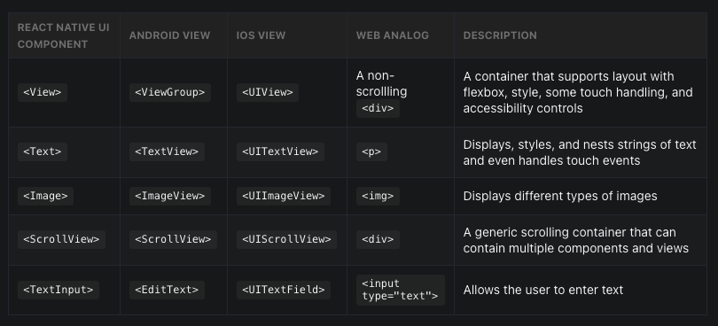
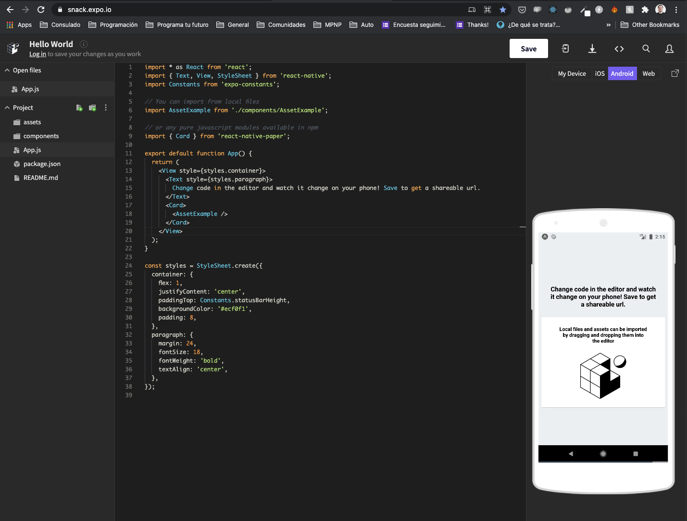
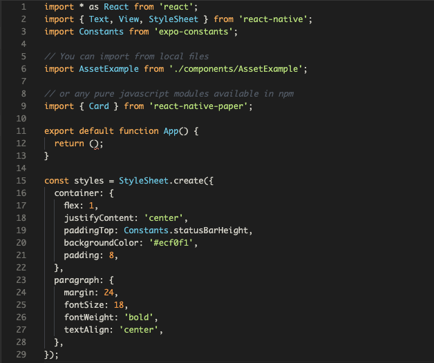
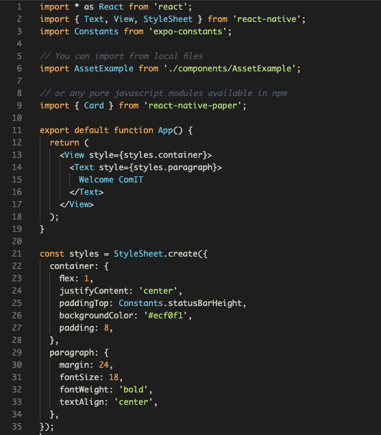
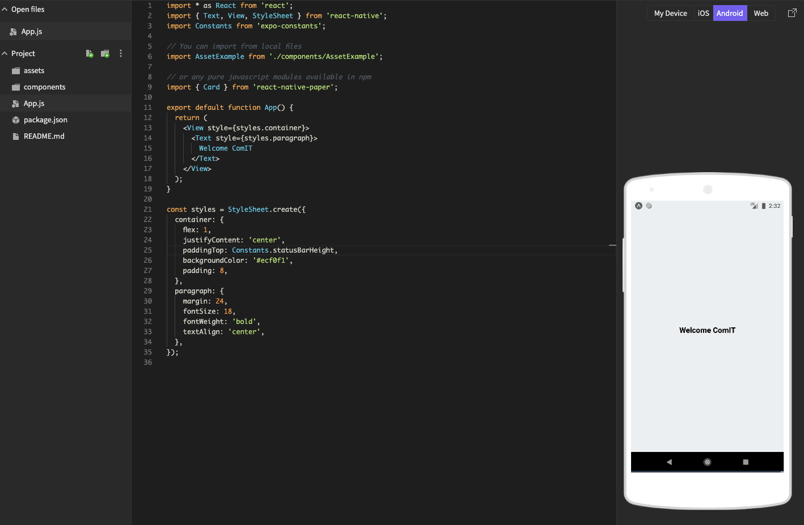
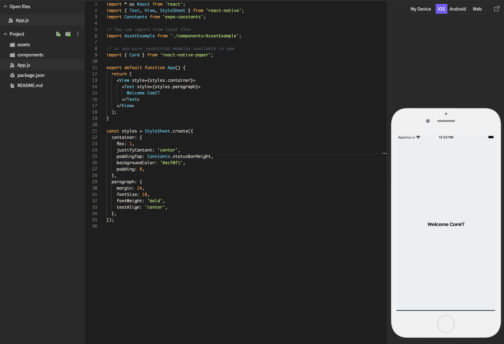
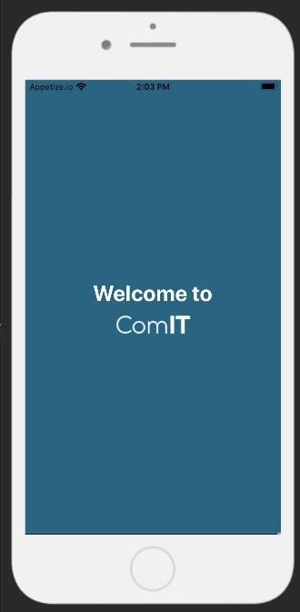
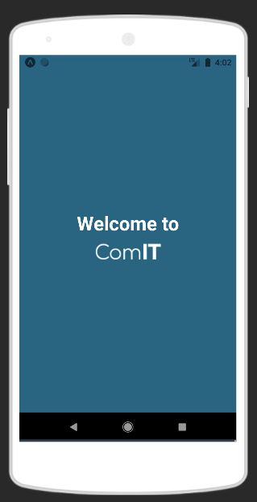

# React Native

## What's React Native?

[React Native](https://reactnative.dev) is an JavaScript mobile open-source framework created by Facebook that allows us to create Android and iOS applications.

It’s based on [React](https://reactjs.org), Facebook’s JavaScript library for building user interfaces, but instead of targeting the browser, it targets mobile platforms. 

React Native makes it easy to simultaneously develop for both Android and iOS.

## How does it work?

JavaScript:

* JavaScript is a scripting programming language mainly used to create Web Apps
* It's one of the most used programming languages
* To learn more about JavaScript you can visit [MDN Web Docs Site](https://developer.mozilla.org/en-US/docs/Learn/JavaScript/First_steps/What_is_JavaScrip)

React.js:
 
* JavaScript Library to build UI (User Interfaces)
* It's mainly used for Web Development
* Uses ReactDOM to render Web React components
* To learn more about React you can visit the [Oficial Site](https://reactjs.org)

 React Native:

 * As it's a framework it will give us a collection of React components that we can use out of the box and combine to create new custom components for our apps.
 * The components will compile into native widgets
 * Gives us access to native API's like the Camera using JavaScript
 * Connects JavaScript code and the native platform
 * To learn more about React Native you can visit the [Oficial Site](https://reactnative.dev)

```
If we combine the JavaScript language, React.js features and React Native ones, we end up getting everything we need to start building iOS and Android real native mobile apps.
```

As part of this course we'll learn:

* How to code using JavaScript as our main language
* The React main concepts and features
* How to use React Native to build native apps
* Different JavaScript Libraries / Modules that will help us solving common taks
* JavaScript testing libraries to help us prevent bugs and make our code more stable

## Core Components

* In Android and iOS development, a view is the basic building block of UI
* A view is a small rectangular element on the screen which can be used to display text, images, or respond to user input. 
* Some views can contain nested views

For example:

Android has:
* ViewGroup
* ImageView
* TextView

And in iOS:
* UIView
* UIImageView
* UITextView

Example:


In React Native we have:

* View
* Image
* Text

The React Native doc have a [great example](https://reactnative.dev/docs/intro-react-native-components) to show how RN components will compile into native:



This means that a `View` React Native component will compile into an Android `ViewGroup` and a iOS `UIView`. 

```
We'll write React Native components that will compile into the native version of the OS that's running our application.
```

## Create your first App

In order to create our first app we should install many tools that will help us get the job done but there's a simple way to see React Native in action thanks to [Expo Snack tool](https://snack.expo.io)

* Open [Expo Snack site](https://snack.expo.io)



On the left side of the screen we have the Project Files and structure.

The middle section is the code editor were we can write our code.

Finally on the right we have Android and iOS emulators running that will execute the code that we have in our code editor.

* Delete the Code from line 13 to 20. Should only have the return () code
* Your code should loke like this:



* Add the following code inside the return statment (between round brackets):
```js
return (
  <View style={styles.container}>
    <Text style={styles.paragraph}>
      Welcome ComIT
    </Text>
  </View>
);
```
* Your code should loke like this:



* Select Android device Tab and click `Tap to play` and see your code running on Android



* Do the same by selecting the iOS device and `Tap to play` there as well to see it running on iOS



### Pimp my App

As we're creating a ComIT app it should use the right style.

1. Change the text from `Welcome ComIT` to `Welcome to`.
2. Change the `container` background color from `'#ecf0f1'` to `'#146e83'`

```js
container: {
  flex: 1,
  justifyContent: 'center',
  paddingTop: Constants.statusBarHeight,
  backgroundColor: '#146e83',
  padding: 8,
},
```
3. Change the text color to white so it looks better. We can do this by adding the color property to the paragraph style. Will look way better.

```js
paragraph: {
  margin:24,
  fontSize: 24,
  fontWeight: 'bold',
  textAlign: 'center',
  color: 'white',
},
```
4. Add the ComIT logo bellow the Text component:

```js
return (
  <View style={styles.container}>
    <Text style={styles.paragraph}>
      Welcome to
    </Text>
    <Image source={{uri: 'https://cdn1.comit.org/images/logo.png'}} style={{width: 115, height: 52}} />
  </View>
);
```
5. We need to center the logo and we can do that by adding the `alignItems: 'center'` property / value to our container.

```js
container: {
  flex: 1,
  justifyContent: 'center',
  paddingTop: Constants.statusBarHeight,
  backgroundColor: '#146e83',
  padding: 8,
  alignItems: 'center',
},
```
6. Lets remove the extra space between text and logo by deleting the paragraph margin style.

```js
  paragraph: {
    fontSize: 24,
    fontWeight: 'bold',
    textAlign: 'center',
    color: 'white',
  },
```

7. Finally we can just increase the font size to make it look better. Set the `fontSize` property to `32`

```js
  paragraph: {
    fontSize: 32,
    fontWeight: 'bold',
    textAlign: 'center',
    color: 'white',
  },
```

8. Awesome, your app should look like this now:

 



## Summary

We learned about what React Native is, how it works and how the core components work. Also, we created our first app using the Expo Snack tool and we got the chance to write some code.


