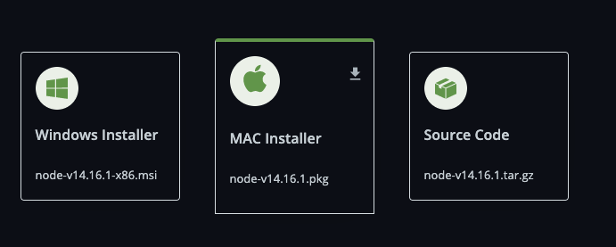
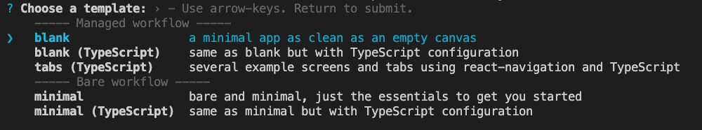
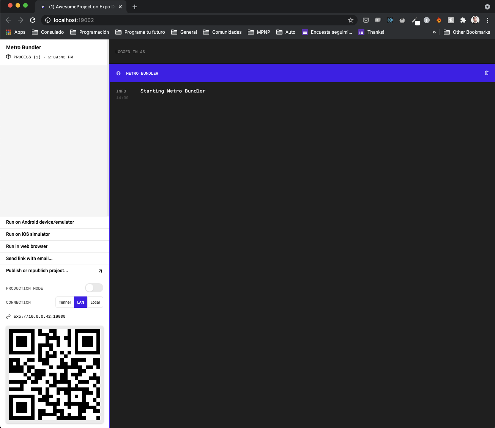
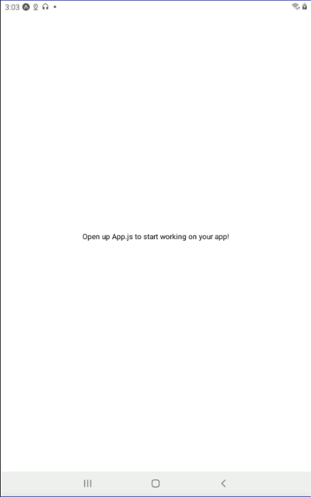
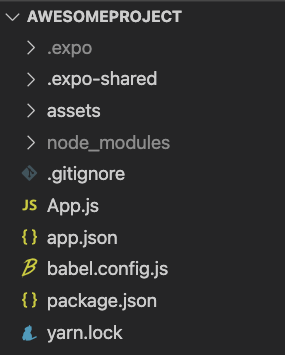

# Setup

In order to setup our dev environment we're going to follow [React Native setup guide](https://reactnative.dev/docs/environment-setup) using the `Expo CLI Quickstart` tab.

## Install Node

To folow the guide you need to have installed Node already ( Node 12 LTS or higher).

There's different ways to install Node but it the easies way is to [donwload the installer from the Node.js official site](https://nodejs.dev/download). At the time of writing you should use / instal Node.js 14.

[Node.js®](https://nodejs.org/) is a JavaScript runtime built on Chrome's V8 JavaScript engine. Node.js uses an event-driven, non-blocking I/O model that makes it lightweight and efficient. Node.js' package ecosystem, npm, is the largest ecosystem of open source libraries in the world. You can read the following [guide](https://nodejs.dev/learn/the-v8-javascript-engine) if you want to learn more about it.

Choose the right version for your OS (Operating System).



Once you downloaded the right version just follow the Wizard to install it.

To test if node has been installed you should open a Terminal, Windows Command Prompt, Powershell or a similar command line tool and type the following node command `node -v` and see the installed version.

```bash
$ node -v

v14.x.x
```

With Node you also install NPM that's a Node package manager. Try the folloing command as well:

```bash
$ npm -v

7.x.x
```

Don't worry if you get a different Node / NPM version as the one here, just make sure that Node version is higher than 12 as required by React Native.

As we're going to use Node.js to run our JavaScript exercises it would be awesome to check out the following [Node.js REPL guide](https://nodejs.dev/learn/how-to-use-the-nodejs-repl) to get used to it.

If you have browser JavaScript experience you can read the following [guide](https://nodejs.dev/learn/differences-between-nodejs-and-the-browser) to see the difference between environments.

## Install Expo CLI

Expo CLI is a command line app that is the main interface between a developer and Expo tools. You'll use it for a variety of tasks, such as:

* Creating new projects
* Developing your app: running the project server, viewing logs, opening your app in a simulator
* Publishing your app JavaScript and other assets and managing releasing them over the air
* Building binaries (apk and ipa files) to be uploaded to the App Store and Play Store
* Managing Apple Credentials and Google Keystores

To install expo-cli globaly run the following command on your terminal:

```bash
$ npm install -g expo-cli
```

Run expo --version to determine what version you are currently working with.

```bash
$ expo --version

4.x.x
```

## Install Expo Go in your iOS or Android device 

The fastest way to get up and running is to use the Expo Go app on your iOS or Android device. Expo Go allows you to open up apps that are being served through Expo CLI.

* [Android Play Store](https://play.google.com/store/apps/details?id=host.exp.exponent) - Android Lollipop (5) and greater.
* [iOS App Store](https://itunes.com/apps/exponent) - iOS 11 and greater.

## Create AwesomeProject App.

Now that we have Expo CLI installed we can create our first React Native project.

Following the React Native guide lets create an AwesomeProject

```bash
expo init AwesomeProject
```

After running this command you should see some options to create your new project.
We'll use the blank option for now.



This will create a new folder with the project name and all the necesary files to run our blank app.
In order to start the app we need to change directory (cd) to the new one. We can do it by running the following command:

```bash
cd AwesomeProject
```

To make sure you're insde the AwesomeProject project you can execute the following command and see a path that includes AwesomeProject at the end:

```bash
pwd

/AwesomeProject
```

To start the project we can either use `npm start` or `expo start`. At the end npm start will call expo start for us.
This will start the server.

```bash
$ npm start
```

Expo CLI starts Metro Bundler, which is an HTTP server that compiles the JavaScript code of our app using Babel and serves it to the Expo app. It also pops up Expo Dev Tools, a graphical interface for Expo CLI.



## Opening the app on your phone/tablet

The easiest way to run your project in a mobile device is to use the Expo Go app.

* On your iPhone or iPad, open the default Apple "Camera" app and scan the QR code you see in the terminal or in Expo Dev Tools.
* On your Android device, press "Scan QR Code" on the "Projects" tab of the Expo Go app and scan the QR code you see in the terminal or in Expo Dev Tools.

If everything goes well you should be able to see the app running on your device:



## Open AwesomeProject app code in Visual Studio Code

* Open VS Code
* File > Open
* Select the AwesomeProject folder
* Click Open

You should see the following app structure under VS Code explorer (left side of the screen):



* Open the App.js file by double clicking it and you should see the following code:

```js
import { StatusBar } from 'expo-status-bar';
import React from 'react';
import { StyleSheet, Text, View } from 'react-native';

export default function App() {
  return (
    <View style={styles.container}>
      <Text>Open up App.js to start working on your app!</Text>
      <StatusBar style="auto" />
    </View>
  );
}

const styles = StyleSheet.create({
  container: {
    flex: 1,
    backgroundColor: '#fff',
    alignItems: 'center',
    justifyContent: 'center',
  },
});

```

This looks pretty similar to the first app that we created using Expo Snack in the browser, right?

* Replace the `Open up App.js to start working on your app!` text by `Welcome to React Native ComIT` and save the file.

After saving you should see the change in your mobile device. This means that you can edit your app using VS Code and see the changes right away in your mobile device thanks to React Native and Expo.

If you need more help installing React Native you can check the following guides:

* [React Native - Setting up the development environment](https://reactnative.dev/docs/environment-setup)
* [Expo - Installation](https://docs.expo.io/get-started/installation/#2-expo-go-app-for-ios-and)
* [Expo - Create a new app](https://docs.expo.io/get-started/create-a-new-app/#opening-the-app-on-your-phonetablet)